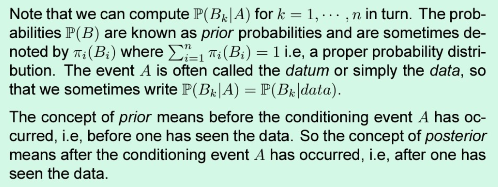

# Bayes theorem

[[Conditional probability]] [[Law of total probability]]

P(B|A) = P(A|B)*P(B)/P(A)

extending this
P(B|A) = P(A|B)*P(B)/ΣP(A|B)*P(B)

#classnotes #psm #ch1 #probability #appliedstats
