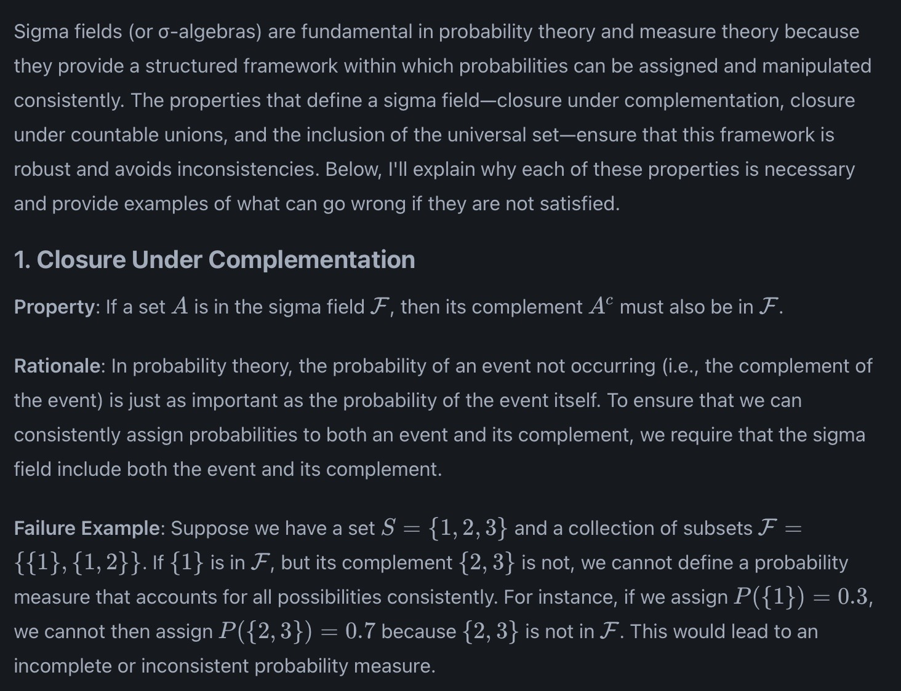
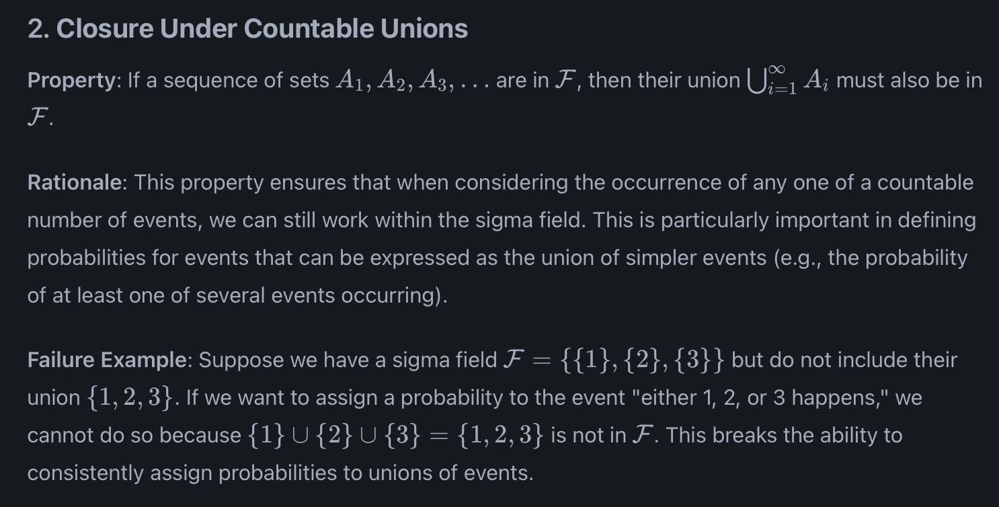
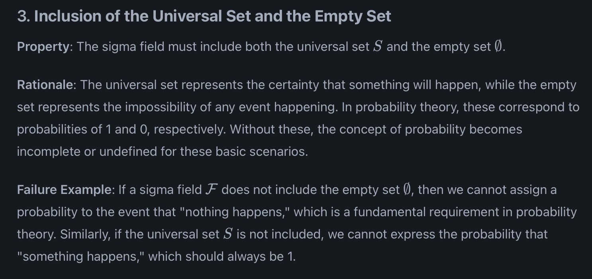
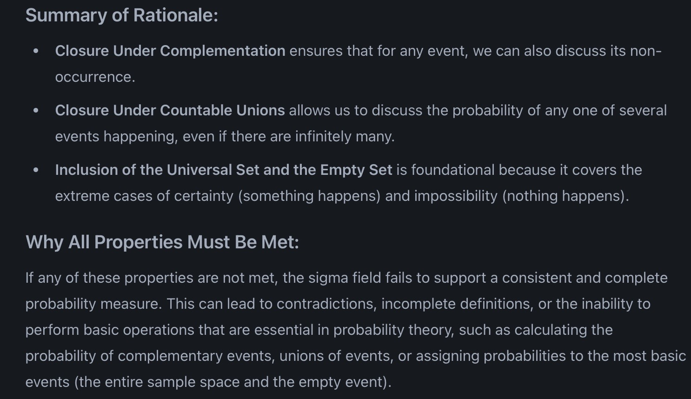

# Field and sigma field

[[Probability space]]

A field is fundamentally a collection of subsets of Ω that obeys 3 conditions
Closure under union
Closure under complement
Inclusion of Universal/empty set

Smallest σ field {ɸ, Ω}
Largest sigma field is collection of all possible subsets of σ or power denoted 2^Ω or P(Ω)

Event: Elements or members of a σ field are called events

?
Why the distinction between σ  field and field ?
What if a sample point is not in F can we still say its probability = 0 ? e.g. {1, {2,3,4,5,6}, {1,2,3,4,5,6}} P(2)

Sigma Field:
These conditions are important because they align with Axioms of probability (Kolmogorov)

#classnotes #psm #probability #ch1 #appliedstats
